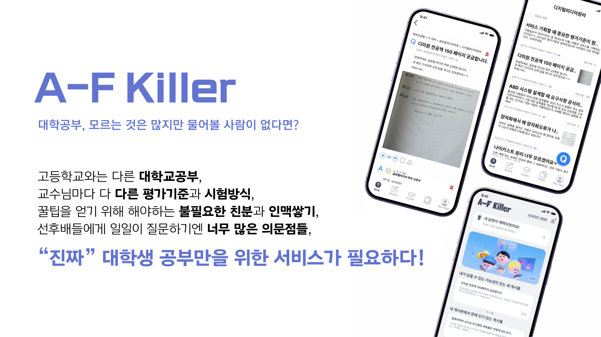

# 📝 내 손안의 멘토, A-F Killer
🏆 2024 숭실대학교 IT프로젝트 우수상 🏆

## 🚀 소개
### 프로젝트 소개

## 🛠️ 기술 스택
        

## 👥 팀원
| **Name** | **Position** |
|:--------:|:------------:|
| [**김난슬**](https://github.com/seulnan) | `PM`, `BE` |
| [**김연서**](https://github.com/daeGULLL) | `BE` |
| [**이동현**](https://github.com/Second-FirstKiss) | `Design`, `FE` |
| [**오준우**](https://github.com/ojjun4527) | `FE` |
| **이예진** | `Design`, `Marketing` |
